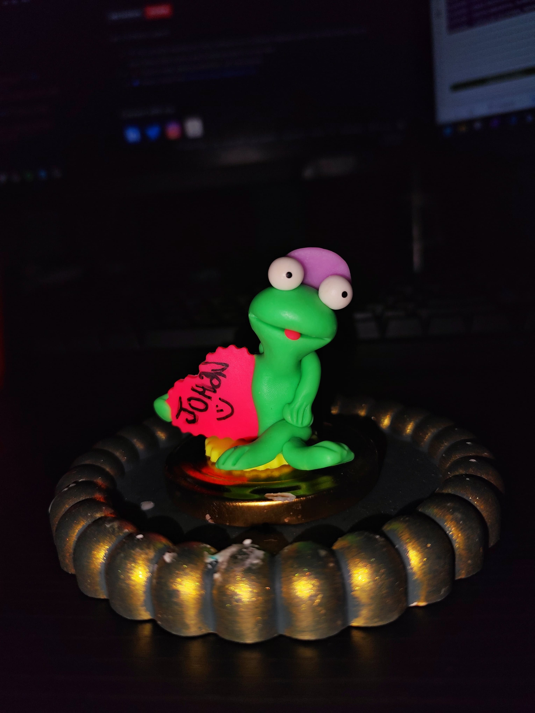

<!-- 

 -->

<!--

-->
<h1 align="center">Hi👋, I'm Johan</h1>

<!-- 
   -->
  

  

    
       
  

  

---

### 👩‍💻 About Me :
I am a Full Stack Developer  from Colombia.

* 🔭 I’m currently working at Ceiba Software Houses as a Software engineer and contributing to frontend and backend for building web applications
* 🌱 Exploring Technical Content Writing.
* ⚡ In my free time, I love to read, playing football, self-developing
  

## 🛠️ Languages and Tools 

<!-- 

 -->

  

## 📊 My Github Stats

<!-- 

    

 -->
   
    
  
   
  <b>Note:</b> Top languages is only a metric of the languages my public code consists of and doesn't reflect experience or skill level.

 

<!--  -->
<!-- ### ✍️ Blog Posts : -->
